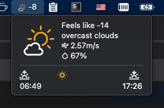
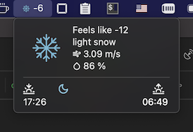

# Weather

A menubar app which shows current weather for a given location:





Whem clicked, a menu with more detailed information is shown, it also includes the sunrise and sunset times.

# Installation

This app is using [OpenWeather](https://openweathermap.org) as the data provider, so first you need to create an account and get an app id in order to use the API. Then

- install [Hammerspoon](http://www.hammerspoon.org/) - a powerful automation tool for OS X
   - Manually:

      Download the [latest release](https://github.com/Hammerspoon/hammerspoon/releases/latest), and drag Hammerspoon.app from your Downloads folder to Applications.
   - Homebrew:

      ```brew install hammerspoon --cask```
 - download [weather.spoon](https://github.com/fork-my-spoons/github-activity.spoon/releases/download/v1.0/github-activity.spoon.zip), unzip and double click on a .spoon file. It will be installed under ~/.hammerspoon/Spoons folder.
 - open ~/.hammerspoon/init.lua and add the following snippet:

```lua
-- weather
hs.loadSpoon('weather')
spoon.weather:setup{
  app_id = '<your app id>',
  -- units = 'f',
  lat = 45.501670,
  lon = -73.567221,
--   city = 'Montreal,QC,CA'
}
spoon.weather:start()
```

By defaul the temperature is in celsius, to change it to fahrenheit add parameter units with value 'f'. For the location you can either use latitude and longtitude, or [city name](https://openweathermap.org/current#name).

This app uses icons, to properly display them, install a [feather-font](https://github.com/AT-UI/feather-font) by [downloading](https://github.com/AT-UI/feather-font/raw/master/src/fonts/feather.ttf) this .ttf font and installing it.
